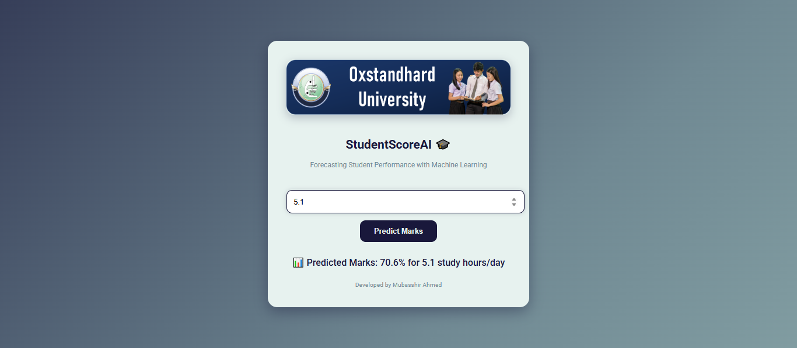

# StudentScoreAI 🎓  
*Forecasting Student Performance with Machine Learning*  

  
  
  
  
  

---

## 📌 Project Overview  
**StudentScoreAI** is a **Machine Learning web application** that predicts student marks based on their study hours.  
It demonstrates the **end-to-end ML workflow**: from exploratory data analysis (EDA) → model training & evaluation → exporting the model → deploying with Flask → interactive UI.  

This project is designed to be **professional, elegant, and recruiter-ready**.  

---

## ✨ Features  
- User-friendly **web interface** for predictions  
- **Linear Regression** (with Decision Tree comparison) for prediction  
- Clean & **premium UI** using a teal–sage–night gradient palette  
- Predictions logged with **timestamp + input + output**  
- End-to-end notebook for **data exploration and training**  

---

## 🛠️ Tech Stack  
- **Python 3.9**  
- **Flask** → Web framework  
- **Scikit-Learn** → Machine Learning models  
- **Pandas & NumPy** → Data handling  
- **Matplotlib** → Visualization  
- **Joblib** → Model persistence  

---

## 📂 Project Structure  

```
01_StudentScoreAI/
├─ app/
│  ├─ static/images/college_banner2.png   # Banner image
│  ├─ templates/index.html                # Frontend (UI)
│  ├─ app.py                              # Flask backend
│  └─ student_mark_prediction.pkl         # Trained ML model
├─ data/
│  ├─ student_info.csv                    # Training dataset
│  └─ predictions_log.csv                 # Logs of user predictions
├─ notebook/
│  └─ StudentScoreAI.ipynb                # End-to-end ML workflow
├─ results/
│  ├─ example_predictions.csv             # Sample predictions
│  ├─ metrics.json                        # Model performance metrics
│  └─ UI_Overview.png                     # App UI screenshot
├─ requirements.txt                       # Dependencies
└─ .gitignore                             # Git ignore rules
```

---

## ⚙️ How to Run  

### 🔹 Clone the Repository  
```bash
git clone https://github.com/your-username/StudentScoreAI.git
cd StudentScoreAI
```

### 🔹 Create Virtual Environment  
```bash
python -m venv venv
# Activate
venv\Scripts\activate     # Windows
source venv/bin/activate    # Mac/Linux
```

### 🔹 Install Requirements  
```bash
pip install -r requirements.txt
```

### 🔹 Run Notebook (Optional, for training/EDA)  
```bash
jupyter notebook notebook/StudentScoreAI.ipynb
```

### 🔹 Run Flask App  
```bash
python app/app.py
```
Visit: **http://127.0.0.1:5000/**  

---

## 📊 Sample Output  

### 🔹 Model Metrics  
Example (saved in `results/metrics.json`):  
```json
{
  "LinearRegression": {"MAE": 2.13, "RMSE": 3.21, "R2": 0.94},
  "DecisionTree": {"MAE": 3.42, "RMSE": 4.87, "R2": 0.89},
  "best_model": "LinearRegression"
}
```

### 🔹 Web UI  
  

---

## 🔮 Future Enhancements  
- Add more features (attendance, sleep hours, prior scores).  
- Try advanced models (Ridge/Lasso, RandomForest, GradientBoost).  
- Deploy live (Render, Heroku, or AWS).  
- Add dark/light theme toggle in UI.  

---

## 👨‍💻 Author  
**Developed by: Mubasshir Ahmed**  
📌 Data Science Enthusiast | ML Explorer | AI Learner  
🔗 [GitHub](https://github.com/mubasshirahmed-3712) | [LinkedIn](https://www.linkedin.com/in/mubasshirahmed3712/)  

---
⭐ If you found this project useful, don’t forget to **star this repo** and connect with me!  
